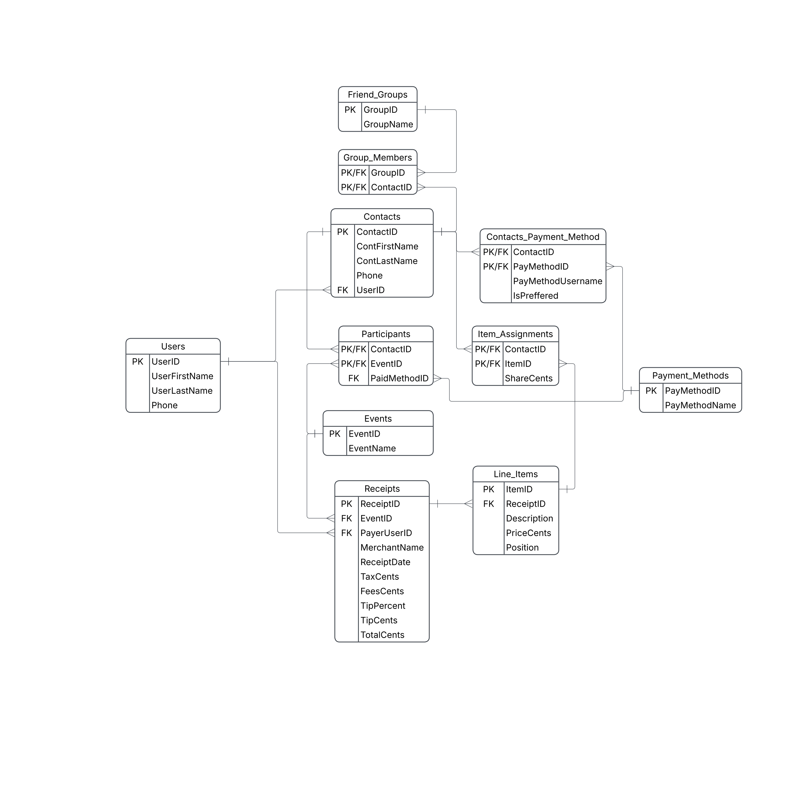

# IOYA

Scan a receipt, match items to friends, and make sure you get paid back.

**Team:** Jackson, Tye, Nick, Tanner

## App Summary

When one person pays a shared restaurant bill, they are left doing math on a receipt, splitting shared appetizers, spreading tax and tip fairly, and then chasing each friend for their share. That process is slow, easy to get wrong, and makes it easy to forget who still owes money. IOYA is for the person who picks up the tab for a group of friends, roommates, or family. The app turns a receipt into line items, lets the payer tap which friend had which item (including shared items), and splits tax, tip, and fees in proportion to what each person ordered. Each outing is saved as an event, so the Home screen's Paid / Unpaid board and the History screen show exactly who has paid you back and how. Saved contacts with their preferred payment method (Venmo, PayPal, Zelle, or cash) and friend groups like "Family" or "Lunch crew" make the next split faster.

## ERD



The original diagram is also in [`docs/ioya-erd.pdf`](docs/ioya-erd.pdf).

**Relationships and cardinality**

| Relationship | Cardinality | Through |
|---|---|---|
| Users → Contacts | one-to-many | `Contacts.UserID` |
| Users → Receipts (as the payer) | one-to-many | `Receipts.PayerUserID` |
| Friend_Groups ↔ Contacts | many-to-many | `Group_Members` |
| Contacts ↔ Payment_Methods | many-to-many | `Contacts_Payment_Method` (stores the username and whether it is preferred) |
| Events → Receipts | one-to-many | `Receipts.EventID` |
| Receipts → Line_Items | one-to-many | `Line_Items.ReceiptID` |
| Contacts ↔ Events | many-to-many | `Participants` |
| Payment_Methods → Participants (how they paid) | one-to-many | `Participants.PaidMethodID`, empty until the person pays |
| Contacts ↔ Line_Items | many-to-many | `Item_Assignments` (stores each person's share in cents) |

**How the diagram becomes tables.** The SQL in [`supabase/schema.sql`](supabase/schema.sql) uses the same 11 tables and columns, written in Postgres's lowercase snake_case style: `Users.UserFirstName` becomes `users.user_first_name`, `Contacts_Payment_Method` becomes `contacts_payment_method`, and so on. `IsPreffered` is spelled `is_preferred` in the database. Money is stored as whole cents, so `1959` means $19.59.

**The payer is also a contact.** Each user has one row in `contacts` with the same name and phone as their `users` row. That lets the payer be a participant and be assigned items like everyone else, and the app shows that contact as "You."

## Tech Stack

| Layer | What we used | Why |
|---|---|---|
| Database + backend | [Supabase](https://supabase.com) (hosted PostgreSQL with an automatic REST API) | Most of our group already knows Supabase, the free tier covers this project, and the Table Editor lets everyone see the data without installing a database. |
| Frontend | Plain HTML, CSS and JavaScript in [`public/index.html`](public/index.html), using the [`supabase-js`](https://supabase.com/docs/reference/javascript) library | Our screens started as one clickable HTML prototype, so we kept it and connected it to Supabase. There is no build step. |
| Web server | Node.js 18+ with Express, in [`server.js`](server.js) | Serves the page and passes it the Supabase URL and key from `.env`, so they are never committed to GitHub. |
| Secrets | A git-ignored `.env` file | [`.env.example`](.env.example) shows the format. |

**Security.** The app has no login yet, so it uses Supabase's public **anon** key and always acts as the sample user, Demo Payer. Row Level Security is on for every table. With the anon key, the app can:

- **read** every table;
- **update only `participants.paid_method_id`**, which is the "Mark as paid" button;
- **add, edit and delete contacts** only through two database functions, `save_contact` and `delete_contact` (in [`supabase/contacts-sync.sql`](supabase/contacts-sync.sql)). They check the input and save a contact and its payment methods together in one transaction. A contact who is on a past split can't be deleted, because that would erase their items from the receipt.

Every other change has to be made in the Supabase dashboard. Never put the `service_role` key or the database password in `.env` or in the code.

**Saved to Supabase:** contacts you add, edit or delete on the Contacts screen, and "Mark as paid." Everyone using the same Supabase project sees the same data.

**Simulated for now:** scanning a receipt loads a sample receipt, payment requests and reminders are not actually sent, a new split is not saved when you tap Done, and groups can only be edited in the Supabase dashboard.

## How to Get It Running

You need **Node.js 18 or newer** ([download](https://nodejs.org)) and a Supabase project.

### 1. Get the code

```bash
git clone https://github.com/mccleanjackson/ioya.git
cd ioya
npm install
```

### 2. Connect to a Supabase project

**Option A: use our team's existing project (teammates).** Ask a teammate for the project's **Project URL** and **anon public key** (shared privately, not in GitHub), and go to step 3.

**Option B: set up your own project from scratch.**

1. Sign in at [supabase.com](https://supabase.com) and create a new project (the free plan is fine).
2. Open **SQL Editor** → **New query**, paste the whole contents of [`supabase/schema.sql`](supabase/schema.sql), and click **Run**. You should see "Success. No rows returned."
3. Open another **New query**, paste all of [`supabase/seed.sql`](supabase/seed.sql), and click **Run**. The result shows a `setval` column; that is expected.
4. In **Table Editor** you should now see 11 tables, each with sample rows. (`schema.sql` already includes the contact functions, so you don't need to run `contacts-sync.sql` separately.)
5. Find your **Project URL** and **anon public key** under **Project Settings → API** (or the **Connect** button).

### 3. Create your `.env` file

```bash
cp .env.example .env
```

Open `.env` and fill in the two values from step 2:

```
SUPABASE_URL=https://YOUR-PROJECT-ID.supabase.co
SUPABASE_ANON_KEY=your-anon-public-key
```

`.env` is listed in `.gitignore`, so it is never committed.

### 4. Start the app

```bash
npm start
```

Open **http://localhost:3000**. On a laptop the app appears in a phone frame, with a list of screens on the left.

**Troubleshooting**

- `Missing SUPABASE_URL or SUPABASE_ANON_KEY`: `.env` is missing, misnamed, or not in the project folder.
- "Couldn't load your data" in the app: check that the URL and key in `.env` match your project, that you ran both SQL files, and that your internet connection works. Restart `npm start` after editing `.env`.
- `Could not find the function public.save_contact` when saving a contact: the project was set up before contact syncing was added. Run [`supabase/contacts-sync.sql`](supabase/contacts-sync.sql) once in the SQL Editor.
- `permission denied` when saving: you are trying to change something other than a contact or "Mark as paid," which the security rules block on purpose.

## Verifying the Vertical Slice

**The button:** "Mark as paid" on a person who owes you money.

**What happens:**

1. The app sends an update request to Supabase: set `paid_method_id` on the `participants` row for that contact and event.
2. Supabase updates that row in the database.
3. Supabase returns the updated row to the app.
4. The app moves the person from the **Unpaid** column to the **Paid** column and shows "Mom is marked as paid with Venmo."

**Steps (with fresh sample data):**

1. Open http://localhost:3000. On the **Home** screen, the **Recent payments** board shows **Mom, $19.59, Top Cafe** in the **Unpaid** column (3 unpaid, 5 paid).
2. Tap **Mom**. A sheet opens: "Mom owes you $19.59", with **How did Mom pay?** set to Venmo, her preferred method.
3. Tap **Mark as paid**. Mom moves to the **Paid** column (6 paid, 2 unpaid).
4. **Refresh the page** (Cmd+R or Ctrl+R). Mom is still under **Paid**, because the board is loaded from Supabase.
5. Optional: in Supabase, open **Table Editor → participants**. The row with `contact_id` 4 and `event_id` 1 now has `paid_method_id` 1 (Venmo).

**To reset:** tap Mom again and choose **Mark as unpaid**, or run `schema.sql` and then `seed.sql` again in the SQL Editor to restore all the sample data.

## Project Layout

```
server.js              Serves public/ and /config.js (Supabase URL + anon key from .env)
public/index.html      The whole frontend: screens, styles, and Supabase calls
supabase/schema.sql    Creates the 11 tables, security rules and contact functions (drops existing tables first)
supabase/contacts-sync.sql  Adds just the contact functions to a project set up before they existed
supabase/seed.sql      Sample rows for every table
docs/ioya-erd.pdf      Our ERD (docs/ioya-erd.png is the same diagram for this README)
.env.example           Template for your .env file
```
